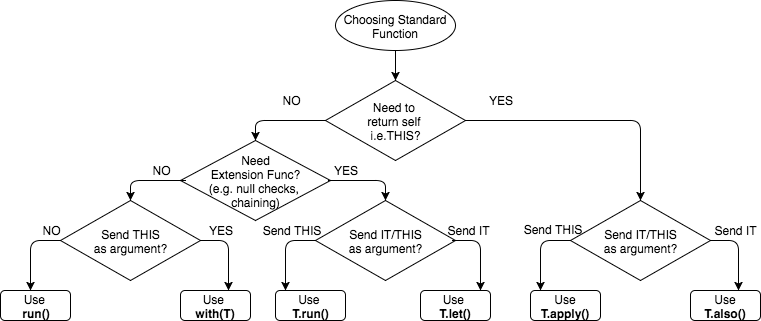

# Kotlin CodeStyle

## Основные положения

Основано на [Coding Conventions][conv] и [Android Style Guide][style]

Перед *Pull Request* **ОБЯЗАТЕЛЬНО** делайте форматирование кода с `Ctrl+Alt+L` или 
поставьте галочку *reformate code* before commit в ide.

## Правила оформления комментариев

см. [Java Code Style][surf] 
см. [Coding Conventions][conv]

## Именование сущностей

### Имена констант в xml:

см. [Java Code Style][surf]

### Именование свойств

Используется `camelCase`. Тип свойства указывается **явно**.

Если используются свойства с функциональном типом, то делайте постфикс `Lambda`
```
val someBeautifulLambda: (Int) -> Int = { it * 2 }
```

Если такое свойство используется как *callback*, то вместо `Lambda` ->  `Callback`.

### Именование методов

Используется `camelCase`. Правила оформления смотри [Android Code Style][surf].

## Структура класса

В отличии от [Coding Conventions][conv] удобнее видеть companion object наверху класса, как и статики в java

* companion object
* приватные поля-ключи(константы)
* публичные val / var свойства
* приватные val/ var свойства
* init
* публичные интерфейсы
* методы
* вложенные классы

#### Расположение методов в классе

**1 вариант**:

* abstract методы
* override методы
* публичные методы
* internal методы
* protected методы
* приватные методы

**по видам модификатора**

* suspend
* inline
* noinline
* infix

**2 вариант**:

* по уровням абстракции (см.  [Java Code Style][surf])

## Организация файлов и пакетов

* Выносить extension-методы в отдельные, логически связанные файлы,
если они не используются только в одном месте. Файл именуется с
постфиксом Extensions, при этом префикс должен соответсвовать классу,
который эти методы расширяют,
т.е `EditTextExtensions`, `ListExtensions`, `ActivityExtensions` и тд.

* Публичные глобальные константы хранить как `const val` свойства в отдельном файле,
на глобальном уровне.

* Утилитные функции удобно хранить либо в виде *глобальных функций*, либо
оборачивать в `object`.

* Название пакетов 
```
// Okay
package com.example.deepspace
// WRONG!
package com.example.deepSpace
// WRONG!
package com.example.deep_space
```

## Форматирование

### Пустые/ не пустые блоки кода
см [Non-empty/Empty Blocks](https://android.github.io/kotlin-guides/style.html#non-empty-blocks)

### Форматирование метода

* когда аргументы не помещается в одну строку:

```kotlin
override fun onPageScrolled(
        position: Int,
        positionOffset: Float,
        positionOffsetPixels: Int
) {
   //some actions
}
```

* Если выражение однострочного метода не помещается в одну строку:
```kotlin
fun signIn(password: String): Single<Profile> =
            api.signIn(ProfileBody.Holder(ProfileBody(login, password)))
                    .compose(RxUtils.subscribeSingleOnIoObserveOnUi())
```

* When

В котлине можно писать return перед when, и тогда же, зачастую, можно сократить до однострочного метода:
```
override fun onOptionsItemSelected(item: MenuItem) = when (item.itemId) {
    R.id.action_settings -> {
        // Code
        true
    }
    R.id.action_favorite -> {
        // Code
        true
    }
    else -> super.onOptionsItemSelected(item)
}
```

### Свойства
см. [Форматирование свойств](https://kotlinlang.org/docs/reference/coding-conventions.html#property-formatting)

### Заголовок классов
см. [Форматирование заголовка класса](https://kotlinlang.org/docs/reference/coding-conventions.html#class-header-formatting)

```kotlin
class SocialNetworksInteractor @Inject constructor(
    private val vkRepository: VkRepository,
    private val fbRepository: FbRepository,
    private val analyticsService: AnalyticsService
) : OAuthCallback, ActivityResultDelegate {

}
```
```kotlin
class Person(
    id: Int,
    name: String,
    surname: String
) : Human(id, name) { ... }
```

### Форматирование управляющих конструкций
см. [Форматирование управляющих конструкций](https://kotlinlang.org/docs/reference/coding-conventions.html#formatting-control-flow-statements)

### Форматирование цепных вызовов
см. [Цепные вызовы](https://kotlinlang.org/docs/reference/coding-conventions.html#chained-call-wrapping)

### Форматирование лямбд
см. [Форматирование лямбд](https://kotlinlang.org/docs/reference/coding-conventions.html#lambda-formatting)

Если метод принимает только лямбду, сразу пишем ее после названия метода,
без круглых скобок

```kotlin
doSomething { //do something }
```

Внутри лямбды удобно использовать `it`, если *не требуется* уточнения или
внутри *не используется* еще одна лямбда, требующая параметр внешней лямбды(см. 2)
1)
``` kotlin
api.signUp(ProfileBody.Holder(ProfileBody(login, password)))
                .map { it.profile }
                .compose(RxUtils.subscribeSingleOnIoObserveOnUi())
```
2)
```kotlin
someList.map { objInList ->
	// someAnotherList - коллекция вне лямбды
	someAnotherList.filter { it.id == objInList.id}
}
```

### Форматирование подписок

В методах `subscribeBy` явно подписывать лямбды для лучшей читаемости кода.

```kotlin
subscribeBy(onSuccess = {
	// your code   
}, onError = {
	// your code   
})
```

**Примечание:** Если Observable большой, то стоит выности в переменную (или даже метод)
```kotlin
subscribeBy(onSuccess = {
	// your code   
}, onError = {
	handleError(it) // or handleError, если это переменная, которая принимает лямбду 
})
```

## Идиомы

см. [Idiomatic use of language features](https://kotlinlang.org/docs/reference/coding-conventions.html#idiomatic-use-of-language-features)

### Kotlin scope functions

#### .apply{}

Удобно использовать, когда необходимо  проинициализировать свойства
объекта при передачи, как аргумента, в метод. 

#### .let{}

Удобно использовать как проверку на `null`. При этом, внутри блока let,
переменная будет гарантировано не null. 
```kotlin
var nullableInt: Int? = null

nullableInt = 11

if (nullableInt != null)
// эта проверка ничего не даст, ибо мутабельная переменная не гаратирует того, что она не измениться 


nullableInt?.let {
    it <- гарантировано не нулл
}
```

* Подсказка по выбору нужного скоупа




## Практики и советы

* Обращение к вью через kotlin.synthetic.* (через имена в xml в lower_snake_case).
*Искл*: в контроллерах удобнее использовать findViewById или Anko.find(),
либо инициализацию через lazy {}

* Для конкатенации элементов списка в строку(например с идентификаторами
или именами элементов) удобно использовать метод joinToString().

* Не забывайте, что можно использовать String Interpolation 
```
println("Name: $name")
```

* Рекомендую изменить настройку цветов в Settings(Preferences)-> Editor-> Color Scheme-> Kotlin для 
	* *Android Extensions synthetic properties* в Properties and Variables
	* *Lambda expression default parameter* в Parameters
	* *Var (mutable variable, parameter or property)* в Properties and Variables(e.g. check effect - underscored) 
	* *Interface* в Classes and Interfaces
	* *Named arguments*
	* *Smart-cast implict receiver* в Smart-casts

* Создавайте свои templates(многих привычных шаблонов из java в kotlin пока нету)
   
Не забывайте, что код стайл, в первую очередь, должен помогать команде, и не стоит слепо следовать пастулатом
из сети. Обдуймайте, почему же были приняты те или иные решения. В начале разработки проекта стоит обговорить
общие правила по написанию кода. Как отправную точку, можете взять сей документ. Надеюсь, в будущем этот документ 
будет пополняться и улучшаться уже вашими опыта.  
   
[conv]: https://kotlinlang.org/docs/reference/coding-conventions.html
[style]: https://android.github.io/kotlin-guides/style.html
[surf]: java_codestyle.md
